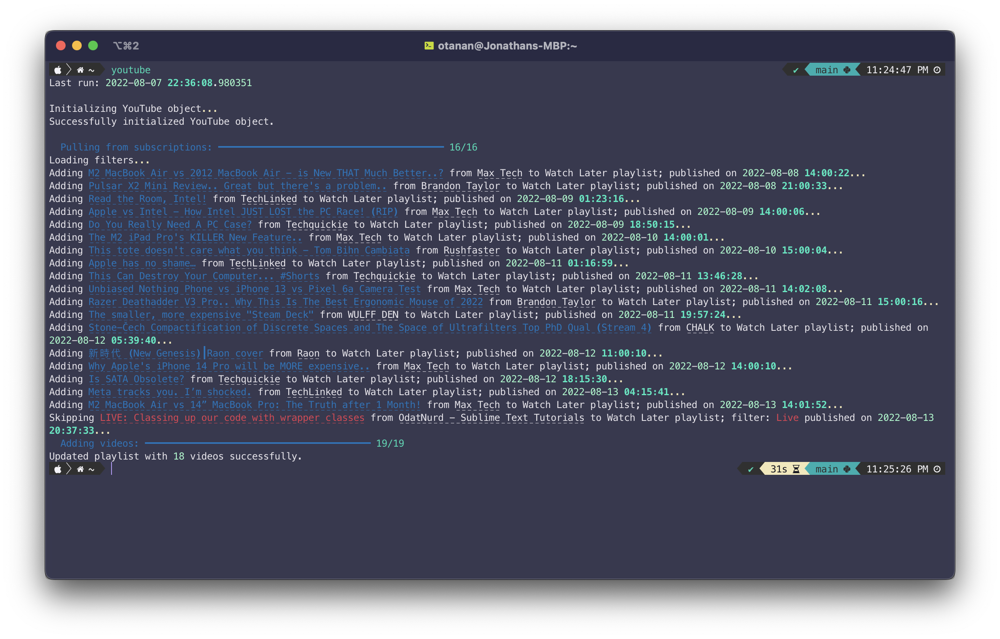

<!-- Filename:      README.md -->
<!-- Author:        Jonathan Delgado -->
<!-- Description:   GitHub README -->

<!-- Header -->
<h2 align="center">YouTube Link (YTLink)</h2>
 
  

    Scripts that connect to YouTube to pull channel video information and queue them into custom playlists through the YTLink package.
     
     
    Status: <em>complete</em>
    <!-- Notion Roadmap link -->
    ·<a href="https://otanan.notion.site/YouTube-Link-8c7f227acc8b48dc86bee016388f5838"><strong>
        Notion Roadmap »
    </strong></a>
  

<!-- Project Screenshot -->

## Examples
One example is subscriptions.py which pulls newest videos from subscriptions and queues them into a custom Watch Later playlist.

Another example is pull_channel.py which grabs all uploads from a given channel and adds them to a custom channel-dependent Watch Later playlist in chronological order.

## Contact
Created by [Jonathan Delgado](https://jdelgado.net/).